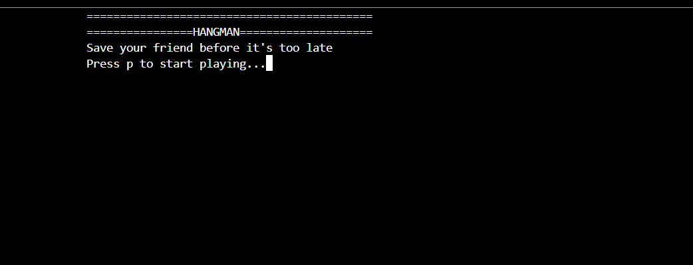
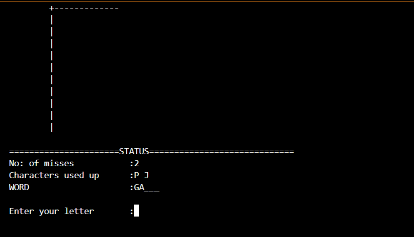
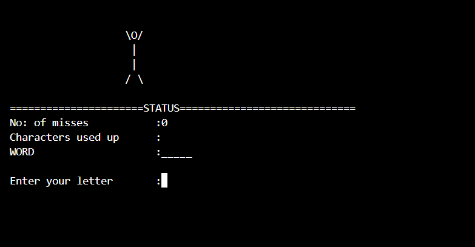
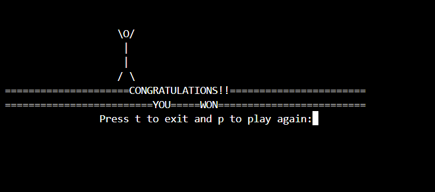
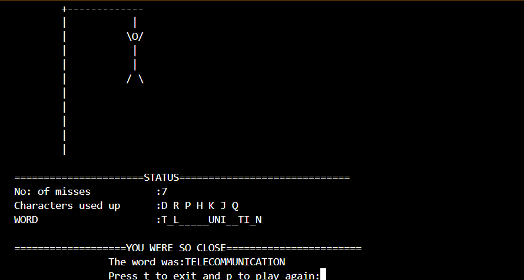

# Hangman Project
**My first project in C++.**
A simple project in C++ that attempts to recreate the classic hangman game.

## GamePlay

    
The game starts off on a simple home page: 

 
Once 'p' is pressed, the game starts. 
A random word(somewhat) is chosen by the compiler and the player is tasked at guessing it in 7 chances. 
 
The hangman is drawn at each step. 0 wrong choices would show a happy man. 
  
The player wins if he/she is able to guess the word in 7 chances.  
 
    OR else.. 

## How to play
The files can be run on the simple terminal in Linux or VS Code.  
Requirements: G++ compiler installed and working

### STEPS:
1. Download the 3 files: [hangman.cpp](https://github.com/Nandana-Neo/HangmanProject/raw/main/hangman.cpp), [hangmanfunc.cpp](./hangmanfunc.cpp) and [hangmanfunc.h](hangmanfunc.h) and put all 3 in the same folder.
1. Open the terminal in that folder.
1. Run the following code: 
`g++ hangman.cpp hangmanfunc.cpp`            
  **Note**: Ensure that g++ compiler is installed 
1. Run this code:
    - In VS Code terminal `a.exe`
    - In linux terminal `./a.out`
 
That is it! You can now play the classic hangman on your favourite terminal. Have fun!

## Logic
I have used linkings across 2 files and also created a header file to facilitate this. 
The program waits for the user to press a 'p'. As soon as the button is pressed, the game starts. 
- It selects a random word from an array of words already written into it. -*Uses rand() function.*
- It starts keeping count of the incorrect guesses as well as the word with'_' representing the word to be filled.
- It prints the man according to the number of incorrect guesses made each time.
- For every input, it also prints the current status of the game which will show the player the word they have filled till now, number of misses/ incorrect guess and the incorrect characters entered.
- Note that for every try, the console is cleared.- *Uses system("clear")*

## Personal Learning

I have learnt a lot of interesting commands through this project. 
- Using rand() function and then selecting the word using rand() and % operator was a really cunning and easy trick to choose random words.
- Using the <windows.h> header file is quite new to me. The following commands' usage were truly mindblowing:
    - system("clear");
    - SetConsoleCursorPosition();
- Drawing the hangman was an extremely scary task at first, but after familiarizing with `COORD` and `SetConsoleCursorPosition()`,this became the most interesting. `SetConsoleCursorPosition()` was an amazing help in the process and I will never forget this cool function.
- This project made me realize the importance of switch cases.
- Not to forget the `system("clear")` function which made the terminal actually game-like.
- Even the function `getch()` made it really fun and fast.

## Scope of Improvement
- The major problem of the game would be less diversity of words. So, I would like to increase the number of words and even add multiple sections like animals, plants, seasons, etc. so that the game becomes more fun.
- I could maybe give clues after 3 wrongs. But this would require to maintain a dictionary / map which could drain the computer.
  
### More to come....
